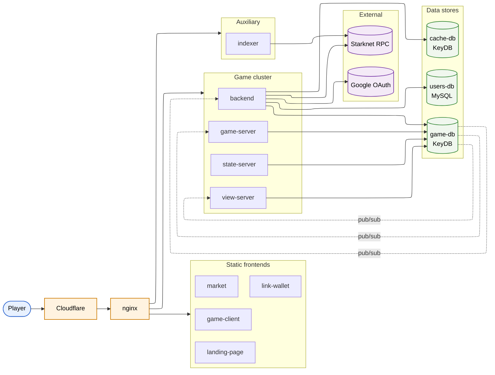

<p align="center">
  
</p>

<p align="center">
  
</p>

<p align="center">
  Free-to-play multiplayer game on <a href="https://www.starknet.io/">Starknet</a>. <b>16777216 cubes</b> to destroy.
</p>

> [!NOTE]
> The game is live at **[play.metacube.games](https://play.metacube.games)**

## Repo layout

```
devops/
  local/               Self-host an instance
  local-dev/           Local development stack (live-mount source, hot reload)
  production/          Ansible-based production deploy (single VPS)
game/
  client/              React + R3F + TypeScript — player UI
  wasm/                C++ → WebAssembly voxel meshing/lighting engine (Emscripten)
  server-view-state/   C++ (uWebSockets) — game / view / state servers
  backend/             Go (Gin) — REST API + chat + stats + on-chain actors
  db-init/             Typescript one-shot — seeds the world into game-db on boot
landing/               Next.js — landing page (metacube.games)
starknet/
  market/              Next.js — NFT marketplace
  link-wallet/         Next.js — Starknet wallet ↔ off-chain account linking
  indexer/             Node — chain event indexer (NFT ownership, listings)
  smart-contracts/     Cairo contracts (NFT collections + marketplace)
tools/                 Offline content-authoring tools
  texture-tools/       Python — generate cube texture atlases + dominant colors
  solid-cubes-detector/ React — voxelize a .glb into cube positions
```

## Architecture

All services run as Docker containers on a single VPS, fronted by an nginx
reverse proxy with TLS terminated at Cloudflare (Full Strict).



- `game-server`: in-game real-time events.
- `view-server`: parallel real-time events serving for viewers.
- `state-server`: serves the full world snapshot on connection.
- `backend`: HTTP/REST API and on-chain actors.
- `game-db` (KeyDB): hot game state and the pub/sub real-time event bus.
- `cache-db` (KeyDB): short-lived tokens (refresh, chat).
- `users-db` (MySQL): durable player data.
- `indexer`: indexes NFT ownership and marketplace listings from Starknet.

## Run your own instance

> [!WARNING]
> Docker is required.

`devops/local/` allows you to run your own instance of the game on your machine. The setup uses the pre-built public images from GHCR.

```bash
cd devops/local
docker compose up -d
```

Then play at <http://localhost>.

### Stopping

```bash
./snapshot.sh           # save world state
docker compose down
```

## Development

> [!WARNING]
> [mkcert](https://github.com/FiloSottile/mkcert) for _localhost_ is required. Generate the cert into `devops/local-dev/certificates/`:
> ```bash
> cd devops/local-dev/certificates
> mkcert -install
> mkcert -key-file localhost-key.pem -cert-file localhost.pem localhost
> ```

For active development with source-mounted containers and hot reload:

```bash
cd devops/local-dev
./setup.sh
docker compose up -d
```

Then access the controller at <https://localhost:3000>. The game is at <https://localhost>.

## Tech stack

- **Frontends**: React 19, Next.js 16, React Three Fiber, Tailwind 4
- **Game servers**: C++20, uWebSockets, redis-plus-plus
- **Backend**: Go 1.26, Gin, go-redis, database/sql + MySQL driver
- **Data**: MySQL 8, KeyDB (Redis-compatible)
- **Blockchain**: Starknet, Cairo, starknet.go, starknetid.go
- **Infra**: Docker Compose, nginx, Cloudflare, Ansible, GitHub Actions

## Team

- [@kamyartaher](https://github.com/kamyartaher): frontend
- [@bastienfaivre](https://github.com/bastienfaivre): backend, infra
- [@NilsDelage](https://github.com/NilsDelage): blockchain

## License

[MIT](LICENSE)
